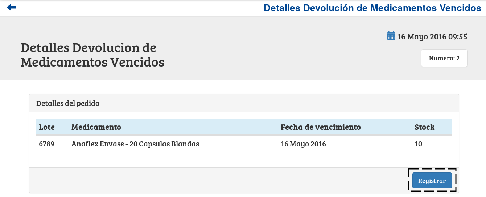

Registrar Devolución de Medicamentos Vencidos
=============================================

Se presentará una pantalla en la cual el usuario deberá seleccionar el laboratorio al cual desea devolverle los medicamentos vencidos. A continuación deberá presionar el botón ``Continuar``.

.. image:: _static/altadevolucion.png
   :align: center

.. ATTENTION::
	El sistema siempre validará que la información ingresada sea correcta. En caso de que los datos ingresados sean incorrectos el sistema lo informará. En este punto, las posibles causas de errores son:

        - No se ingresó un laboratorio.

.. NOTE::
    En caso de que no existan laboratorios con medicamentos vencidos, el selector no mostrara opciones.

Una vez realizado el paso anterior el usuario sera redirigido a la siguiente pantalla:

.. image:: _static/detallesdevolucion.png
   :align: center

Esta pantalla es la encargada de visualizar los lotes vencidos vinculados a medicamentos producidos por el laboratorio seleccionado. 

Esta pantalla ofrece las siguientes funcionalidades:

    - :ref:`Registrar Devolución <registrar-devolucion>`

.. _registrar-devolucion:

Registrar Devolución
++++++++++++++++++++

Si el usuario desea registrar la devolución de medicamentos vencidos, deberá presionar el botón ``Registrar``.

Una vez presionado el botón ``Registrar``, el sistema mostrará la siguiente ventana emergente (modal).

.. image:: _static/regdevolucion.png
   :align: center