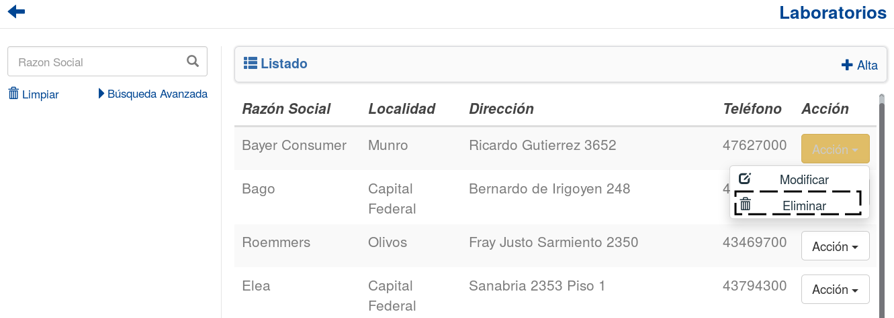

Laboratorios
============
Se presentará una pantalla que contendrá un listado con todos los *Laboratorios* que se encuentren registradas en el sistema hasta la fecha. 

.. image:: _static/laboratorios.png
   :align: center

Junto con el listado, se presentarán un conjunto de funcionalidades que permitirán manipular estos *Laboratorios*.

Estas funcionalidades son:

    - :ref:`Alta Laboratorio <alta-laboratorio>`
    - :ref:`Modificar Laboratorio <modificar-laboratorio>`
    - :ref:`Eliminar Laboratorio <eliminar-laboratorio>`
    - :ref:`Formulario de Búsqueda <formulario-busqueda-laboratorio>`
    
.. _alta-laboratorio:

Alta Laboratorio
----------------
Si el usuario desea crear un nuevo *Laboratorio*, deberá presionar el botón ``Alta``. 

.. image:: _static/btnaltalab.png
   :align: center

A continuación el sistema lo redirigirá a la siguiente pantalla:

.. image:: _static/altalab.png
   :align: center

En esta parte el usuario se le presentará un formulario y deberá ingresar los datos solicitados para dar de alta un nuevo *Laboratorio*.

.. ATTENTION::
    El sistema siempre validará que la información ingresada sea correcta. En caso de que los datos ingresados sean incorrectos el sistema lo informará. 
    En este punto, las posibles causas de errores son:

        - Uno o más campos obligatorios vacíos.
        - Uno o más campos con un formato incorrecto.
        - El CUIT ingresado ya se encuentra asociado a otra organización.
     
Una vez completado el formulario, el usuario tendrá dos opciones: 
    
    - Presionar el botón ``Guardar y Volver``.
    - Presionar el botón ``Guardar y Continuar``.

El botón ``Guardar y Volver`` permite guardar el *Laboratorio* en el sistema y volver a la pantalla 
principal de *Laboratorios*..

El botón ``Guardar y Continuar`` permite guardar el *Laboratorio* en el sistema y seguir dando de alta nuevos *Laboratorios*.

.. _modificar-laboratorio:

Modificar Laboratorio
---------------------
Si el usuario desea modificar los datos de un *Laboratorio*, deberá seleccionar el botón de **Acción** asociado al *Laboratorio* y presionar la pestaña ``Modificar``.

.. image:: _static/btnmodificarlab.png
   :align: center

Una vez realizado el paso anterior, el sistema lo redirigirá a la siguiente pantalla:

.. image:: _static/modificarlab.png
   :align: center

En esta parte al usuario se le presentará un formulario y deberá actualizar los datos asociados al *Laboratorio*.

.. ATTENTION::
    El sistema siempre validará que la información ingresada sea correcta. En caso de que los datos ingresados sean incorrectos el sistema lo informará. 
    En este punto, las posibles causas de errores son:

        - Uno o más campos obligatorios vacíos.
        - Uno o más campos con un formato incorrecto.

Una vez completado el formulario, el usuario deberá presionar el botón ``Guardar Cambios`` y el sistema se encargara de actualizar los datos del *Laboratorio* seleccionado.

.. _eliminar-laboratorio:
   
Eliminar Laboratorio
--------------------
Si el usuario desea eliminar un *Laboratorio*, deberá seleccionar el botón de **Acción** asociado al *Laboratorio* y presionar la pestaña ``Eliminar``.

Una vez realizado el paso anterior aparecerá la siguiente ventana emergente (modal):

.. image:: _static/eliminarlab.png
   :align: center

En esta parte el usuario deberá decidir si confirma la eliminación del *Laboratorio* o no. Si desea confirmar la eliminación deberá presionar el botón ``Confirmar``, caso contrario, presionará el botón ``Cancelar``.

.. NOTE::
    Aquellos *Laboratorios* que cumplan las siguientes condiciones **NO** podrán ser eliminadas:

        - Esten asociados a un Pedido a Laboratorio que aún no ha sido completamente recepcionado
        - Esten asociados a un medicamento que se encuentre en un detalle de un Pedido de Farmacia que aún no haya sido completamente enviado.
        - Esten asociados a un medicamento que posee stock.

    El sistema se encargará de informar al usuario las razones por las cuales el *Laboratorio* seleccionado no puede eliminarse. En dicho caso, el sistema mostrara una ventana emergente (modal) como esta:
    
    .. image:: _static/fallaeliminarlab.png
       :align: center

.. _formulario-busqueda-laboratorio:

Formulario de Búsqueda
----------------------
Si el usuario desea visualizar sólo aquellos *Laboratorios* que cumplan con algunos criterios en específico, deberá utilizar el formulario de búsqueda.

.. image:: _static/busquedalab.png
   :align: center

Este formulario cuenta con dos modalidades:

    - Búsqueda simple: permite buscar los *Laboratorios* por razon social.
    - Búsqueda avanzada: permite buscar los *Laboratorios* por razon social, localidad.

.. NOTE::
    Todos los campos son opcionales, de no especificarse ningún criterio de búsqueda el sistema mostrará todos los *Laboratorios*.

El usuario tendrá que ingresar los parámetros de búsqueda en el formulario, y presionar el botón ``Buscar``. El sistema visualizará aquellos *Laboratorios* que cumplan con todas las condiciones especificadas.

Si el usuario desea limpiar los filtros activos, deberá presionar el boton ``Limpiar``.

.. image:: _static/limpiarlab.png
   :align: center