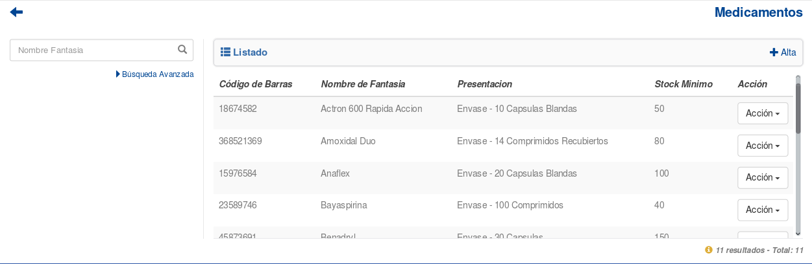
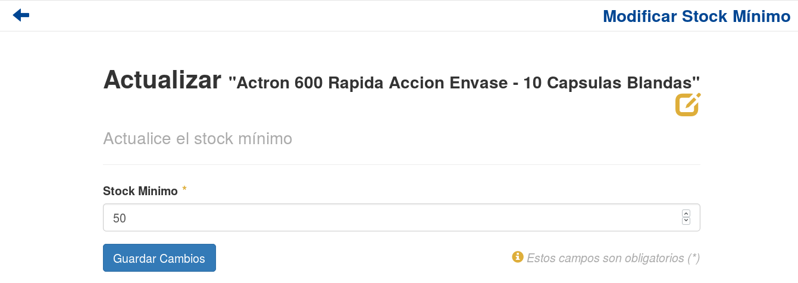
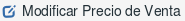
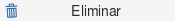
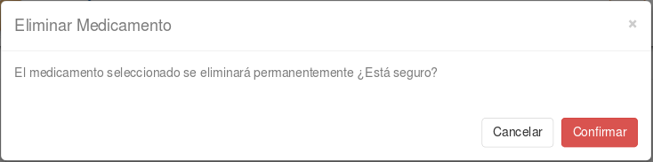

Medicamentos
============
Se presentará una pantalla que contendrá un listado con todos los medicamentos que se encuentren registrados en el sistema hasta la fecha. Junto con el listado, se presentarán un conjunto de funcionalidades que permitirá manipular estos medicamentos.

Estas funcionalidades son:

    - Alta de Medicamento
    - Modificar Stock Mínimo de Medicamento
    - Modificar Precio de Venta de Medicamento
    - Ver Lotes de Medicamento
    - Eliminar Medicamento
    - Formulario de Búsqueda

Alta de Medicamento
-------------------

Si el usuario desea agregar un medicamento, deberá presionar el botón de “Alta”. 

.. image:: _static/botonalta.png

Una vez realizado el paso, el sistema lo redirigirá a la siguiente pantalla:

CAPTURA

En esta parte el usuario se le presentará un formulario y deberá ingresar la información solicitada para dar de alta un nuevo medicamento.
El sistema siempre validará que la información ingresada sea correcta. En caso de que los datos ingresados sean incorrectos el sistema lo informará. 
En este punto, las posibles causas de errores son:

    - Uno o más campos vacíos.
    - El código de barras del medicamento ya existe.
    - La monodroga ingresada no existe.
 
Una vez completado el formulario, el usuario tendrá dos opciones: presionar el botón “Guardar y volver” o presionar el botón “Guardar y continuar”.
El botón “Guardar y volver” permite guardar el medicamento en el sistema y volver a la pantalla principal de medicamentos.
El botón “Guardar y continuar” permito guardar el medicamento en el sistema y seguir dando de alta nuevos medicamentos.

Modificar Stock Mínimo
----------------------
Si el usuario desea modificar el stock mínimo de un medicamento, deberá seleccionar el botón de “Acción” asociado al medicamento y presionar la pestaña “Modificar Stock Mínimo”.

.. image:: _static/modifstockmin.png

Una vez realizado el paso anterior, el sistema lo redirigirá a la siguiente pantalla:

En esta parte el usuario se le presentará un formulario y deberá actualizar la información del stock asociado al medicamento.
El sistema siempre validará que la información ingresada sea correcta. En caso de que los datos ingresados sean incorrectos el sistema lo informará. 
En este punto, las posibles causas de errores son:

    - No se ingresó un stock mínimo.
    - El stock mínimo ingresado no posee un formato correcto.
    - El stock mínimo ingresado es menor a cero.

Una vez completado el formulario, el usuario deberá presionar el botón “Guardar Cambios” y el sistema se encargara de actualizar el stock mínimo del medicamento seleccionado.

Modificar Precio de Venta
-------------------------
Si el usuario desea modificar el precio de venta de un medicamento, deberá seleccionar el botón de “Acción” asociado al medicamento y presionar la pestaña “Modificar Precio Venta”.

Una vez realizado el paso anterior, el sistema lo redirigirá a la siguiente pantalla:

.. image:: _static/modifpreciomed.png

En esta parte el usuario se le presentará un formulario y deberá actualizar la información del precio de venta asociado al medicamento.
El sistema siempre validará que la información ingresada sea correcta. En caso de que los datos ingresados sean incorrectos el sistema lo informará. 
En este punto, las posibles causas de errores son:

    - No se ingresó un precio de venta.
    - El precio de venta ingresado no posee un formato correcto.
    - El precio de venta ingresado es menor a cero.

Una vez completado el formulario, el usuario deberá presionar el botón “Guardar Cambios” y el sistema se encargara de actualizar el precio de venta del medicamento seleccionado.

Ver Lotes
---------
Si el usuario desea ver los lotes de un medicamento, deberá seleccionar el botón de “Acción” asociado al medicamento y presionar la pestaña “Ver Lotes”.

.. image:: _static/verlotes.png

Una vez realizado el paso anterior aparecerá la siguiente ventana emergente (modal):

.. image:: _static/lotesmed.png

Esta ventana mostrará todos los lotes que estén asociados al medicamento.

En caso de que el medicamento seleccionado no posea lotes activos, es decir que tengan stock, o que no se encuentren dentro del rango de vencimento, el sistema mostrara la siguiente ventana emergente (modal):

.. image:: _static/nolotes.png

Eliminar Medicamento
--------------------
Si el usuario desea eliminar un medicamento, deberá seleccionar el botón de “Acción” asociado al medicamento y presionar la pestaña “Eliminar”.

Una vez realizado el paso anterior aparecerá la siguiente ventana emergente (modal):

En esta parte el usuario deberá decidir si confirma la eliminación del medicamento o no. Si desea confirmar la eliminación deberá presionar el botón “Confirmar”, caso contrario, presionará el botón “Cancelar”.

En caso de que el medicamento posea referencias activas que impidan la eliminacion, el sistema mostrara una ventana emergente (modal) del tipo:

.. image:: _static/noeliminarmed.png

Formulario de Búsqueda
----------------------
Si el usuario desea visualizar solo aquellos medicamentos que cumplan determinados criterios, deberá utilizar el formulario de búsqueda.

.. image:: _static/busquedamed.png

Este formulario cuenta con dos modalidades:

    - Búsqueda simple: permite buscar los medicamentos por nombre fantasía.
    - Búsqueda avanzada: permite buscar los medicamentos por nombre fantasía y/o Laboratorio.

Todos los campos son opcionales, de no especificarse ningún criterio de búsqueda el sistema mostrará todos los medicamentos.