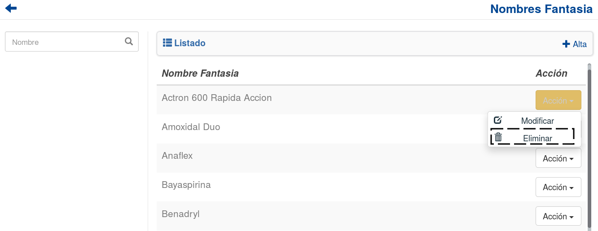

Nombres Fantasia
================
Se presentará una pantalla que contendrá un listado con todos los *Nombres Fantasía* que se encuentren registrados en el sistema hasta la fecha. 

.. image:: _static/nombresfantasia.png
   :align: center

Junto con el listado, se ofrecerán un conjunto de funcionalidades que permitirán manipular estos *Nombres Fantasía*

Estas funcionalidades son:

	- :ref:`Alta Nombre Fantasía <alta-nombre-fantasia>`
	- :ref:`Modificar Nombre Fantasía <modificar-nombre-fantasia>`
	- :ref:`Eliminar Nombre Fantasía <eliminar-nombre-fantasia>`
	- :ref:`Formulario de Búsqueda <formulario-busqueda-nombre-fantasia>`

.. _alta-nombre-fantasia:

Alta Nombre Fantasía
--------------------
Si el usuario desea crear un nuevo *Nombre Fantasía*, deberá presionar el botón ``Alta``. 

.. image:: _static/btnaltanf.png
   :align: center

A continuación el sistema lo redirigirá a la siguiente pantalla:

.. image:: _static/altanf.png
   :align: center

En esta parte el usuario se le presentará un formulario y deberá ingresar los datos solicitados para dar de alta un nuevo *Nombre Fantasía*.

.. ATTENTION::
	El sistema siempre validará que la información ingresada sea correcta. En caso de que los datos ingresados sean incorrectos el sistema lo informará.
	En este punto, las posibles causas de errores son:

		- No se ingresó un nombre fantasía.
		- El nombre fantasía ingresado ya existe en el sistema.

Una vez completado el formulario, el usuario tendrá dos opciones: 

	- Presionar el botón ``Guardar y Volver``.
	- Presionar el botón ``Guardar y Continuar``.

El botón ``Guardar y Volver`` permite guardar el *Nombre Fantasía* en el sistema y volver a la pantalla 
principal de *Nombres Fantasía*.

El botón ``Guardar y Continuar`` permite guardar el *Nombre Fantasía* en el sistema y seguir dando de alta nuevos *Nombres Fantasía*.

.. _modificar-nombre-fantasia:

Modificar Nombre Fantasía
-------------------------
Si el usuario desea modificar los datos de un *Nombre Fantasía*, deberá seleccionar el botón de **Acción** asociado al *Nombre Fantasía* y presionar la pestaña ``Modificar``.

.. image:: _static/btnmodificarnf.png
   :align: center

Una vez realizado el paso anterior, el sistema lo redirigirá a la siguiente pantalla:

.. image:: _static/modificarnf.png
   :align: center

En esta parte al usuario se le presentará un formulario y deberá actualizar los datos asociados al *Nombre Fantasía*.

.. ATTENTION::
	El sistema siempre validará que la información ingresada sea correcta. En caso de que los datos ingresados sean incorrectos el sistema lo informará.
	En este punto, las posibles causas de errores son:

		- No se ingresó un nombre fantasía.
		- El nombre fantasía ingresado ya existe en el sistema.

Una vez completado el formulario, el usuario deberá presionar el botón ``Guardar Cambios`` y el sistema se encargara de actualizar los datos del *Nombre Fantasía* seleccionado.

.. _eliminar-nombre-fantasia:

Eliminar Nombre Fantasía
------------------------
Si el usuario desea eliminar un *Nombre Fantasía*, deberá seleccionar el botón de **Acción** asociado al *Nombre Fantasía* y presionar la pestaña ``Eliminar``.

Una vez realizado el paso anterior aparecerá la siguiente ventana emergente (modal):

.. image:: _static/eliminarnf.png
   :align: center

En esta parte el usuario deberá decidir si confirma la eliminación del *Nombre Fantasía* o no. Si desea confirmar la eliminación deberá presionar el botón ``Confirmar``, caso contrario, presionará el botón ``Cancelar``.

.. NOTE::
	Aquellos *Nombres Fantasía* que cumplan las siguientes condiciones **NO** podrán ser eliminadas:

		- Esten asociadas a un medicamento.

	El sistema se encargará de informar al usuario las razones por las cuales el *Nombre Fantasía* seleccionado no puede eliminarse. En dicho caso, el sistema mostrara una ventana emergente (modal) como esta:
    
    .. image:: _static/fallaeliminarnf.png
       :align: center

.. _formulario-busqueda-nombre-fantasia:

Formulario de Búsqueda
----------------------
Si el usuario desea visualizar sólo aquellos *Nombre Fantasía* que cumplan con algunos criterios en específico, deberá utilizar el formulario de búsqueda.

.. image:: _static/busquedanf.png
   :align: center

Este formulario sólo cuenta con la opción de búsqueda simple en base al nombre del *Nombre Fantasía*. 

.. NOTE::
	Este campo es opcional, de no especificarse ningún criterio de búsqueda el sistema mostrará todos los *Nombres Fantasía*.

El usuario tendrá que ingresar los parámetros de búsqueda en el formulario, y presionar el botón ``Buscar``. El sistema visualizará aquellos *Nombres Fantasía* que cumplan con todas las condiciones especificadas.