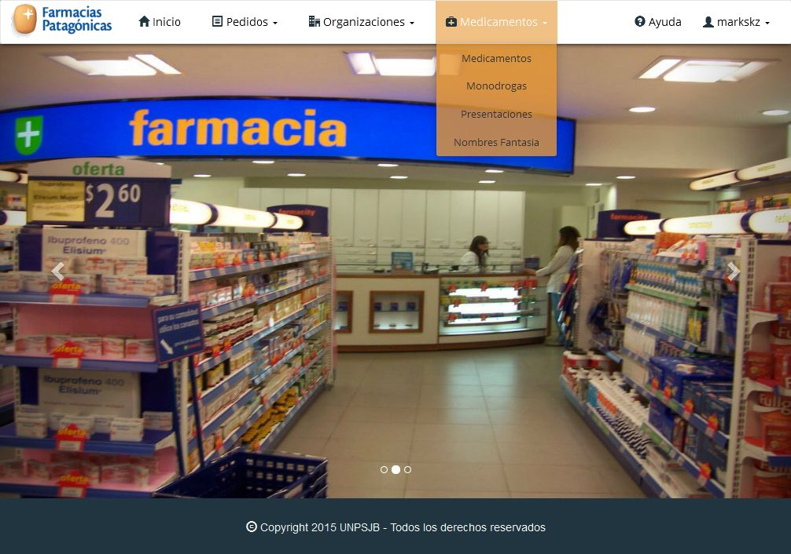

Pantalla Principal
==================
La pantalla principal del sistema ofrece un menú de navegación en el que se encuentran las gestiones generales del sistema.

.. image:: _static/pantallaprincipal.jpg
   :align: center

Estas gestiones son:

	- :ref:`Gestíón de Usuarios<gestion-usuarios>`
	- :ref:`Gestión de Medicamentos<gestion-medicamentos>`
	- :ref:`Gestión de Organizaciones<gestion-organizaciones>`
	- :ref:`Gestión de Pedidos<gestion-pedidos>`

.. _gestion-usuarios:

Gestión de Usuarios
+++++++++++++++++++

La *Gestión de Usuarios* muestra la información relacionada al usuario activo y funcionalidades que esten acordes a los permisos que posea el mismo.

.. image:: _static/gestionusuarios.jpg
   :align: center

Estas funcionalidades son:
	- Entrar al Sistema
	- Agregar Usuario
	- Cerrar Sesión

.. _gestion-medicamentos:

Gestión de Medicamentos
+++++++++++++++++++++++

La *Gestión de Medicamentos* muestra las funcionalidades relacionadas a los medicamentos que manejará el sistema.

Estas funcionalidades estan divididas en estas cuatro secciones:
	- Medicamentos
	- Monodrogas
	- Nombres Fantasía
	- Presentaciones

.. _gestion-organizaciones:

Gestión de Organizaciones
+++++++++++++++++++++++++

La *Gestión de Organizaciones* muestra las funcionalidades relacionadas a las organizaciones que manejará el sistema.

.. image:: _static/gestionorganizaciones.jpg
   :align: center

Estas funcionalidades estan divididas en estas cuatro secciones:
	- Farmacias
	- Clínicas
	- Laboratorios
	- Obras Sociales

.. _gestion-pedidos:

Gestión de Pedidos
++++++++++++++++++

La *Gestión de Pedidos* muestra las funcionalidades relacionadas a los pedidos que manejará el sistema.

.. image:: _static/gestionpedidos.jpg
   :align: center 

Estas funcionalidades estan divididas en estas cinco secciones:
	- Pedido de Farmacia
	- Pedido de Clínica
	- Pedido a Laboratorio
	- Recepción Pedido a Laboratorio
	- Devolución de Medicamentos Vencidos