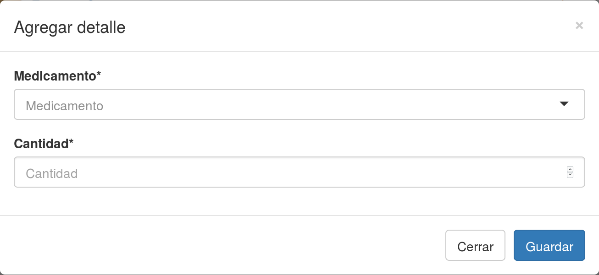
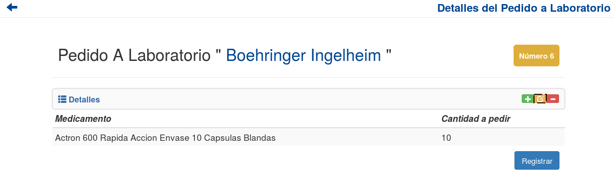
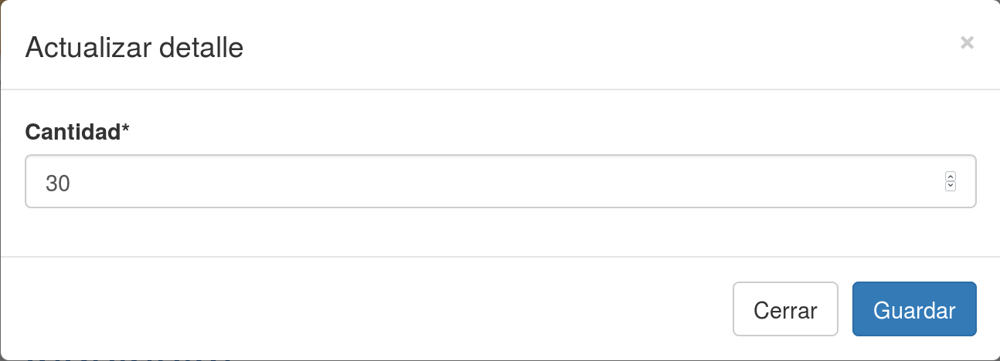
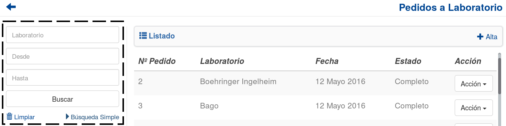
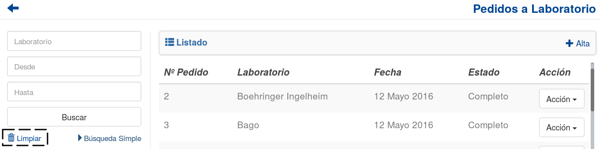

Pedidos a Laboratorio
=====================
Se presentará una pantalla que contendrá un listado con todos los *Pedidos a Laboratorio* que se encuentren registrados en el sistema hasta la fecha. 

.. image:: _static/btnregrecep.png
   :align: center

Junto con el listado, se ofrecerán un conjunto de funcionalidades que permitirán manipular estos *Pedidos a Laboratorio*. 
Estas funcionalidades son:

- :ref:`Alta Pedido <alta-pl>`
- :ref:`Cancelar Pedido <cancelar-pedido-pl>`
- :ref:`Ver Detalles <ver-detalles-pl>`
- :ref:`Ver Remitos <ver-remitos-pl>`
- :ref:`Formulario de Búsqueda <formulario-busqueda-pl>`

.. _alta-pl:

Alta Pedido
-----------
Si el usuario desea crear un nuevo *Pedido a Laboratorio*, deberá presionar el botón ``Alta``.

.. image:: _static/btnaltapedlab.png
   :align: center

A continuación el sistema lo redirigirá a la siguiente pantalla:

.. image:: _static/altapedlab.png
   :align: center
   
En este punto el usuario deberá seleccionar el laboratorio al cual desea realizarle el pedido. A continuación deberá presionar el botón ``Continuar``.

.. ATTENTION::
    El sistema siempre validará que la información ingresada sea correcta. En caso de que los datos ingresados sean incorrectos el sistema lo informará. 
    En este punto, las posibles causas de errores son:

        - No se seleccionó un laboratorio.

Una vez presionado el botón ``Continuar``, se mostrará la siguiente pantalla:

.. image:: _static/detallespedlab.png
   :align: center

Esta pantalla es la encargada de visualizar aquellos detalles que se irán asociando al *Pedido a Laboratorio*.

.. NOTE::  
    De forma automática el sistema se encargará de buscar y agregar al *Pedido a Laboratorio* aquellos detalles que pertenezcan a Pedidos de Farmacia y que cumplan las siguientes condiciones:

        - Que contengan un medicamento producido por el laboratorio al cual se le está realizando el pedido.
        - Que no haya stock suficiente para satisfacer el medicamento que compone al detalle.
        - Que no se encuentren dentro de algún otro *Pedido a Laboratorio*.

Esta pantalla ofrece las siguientes funcionalidades:

    - :ref:`Agregar Detalle <agregar-detalle-pl>`
    - :ref:`Modificar Detalle <modificar-detalle-pl>`
    - :ref:`Eliminar Detalle <eliminar-detalle-pl>`
    - :ref:`Registrar Pedido <registrar-pedido-pl>`

.. _agregar-detalle-pl:

Agregar Detalle
+++++++++++++++
Si el usuario desea agregar un detalle al *Pedido a Laboratorio*, deberá presionar el botón ``Alta Detalle``. 

.. image:: _static/btnadddetallepedlab.png
   :align: center

Una vez realizado el paso anterior aparecerá la siguiente ventana emergente (modal):

En esta parte, se presentará un formulario que el usuario deberá completar para poder dar de alta un nuevo detalle.

.. ATTENTION::
    El sistema siempre validará que la información ingresada sea correcta. En caso de que los datos ingresados sean incorrectos el sistema lo informará. 
    En este punto, las posibles causas de errores son:

        - No se seleccionó un medicamento.
        - No se ingresó una cantidad.
        - La cantidad ingresada no posee un formato correcto.
        - La cantidad ingresada es menor a cero.

Una vez completado el formulario, el usuario deberá presionar el botón ``Guardar`` y el sistema se encargara de agregar el nuevo detalle al pedido.
El usuario podrá seguir dando de alta nuevos detalles, hasta donde considere necesario. Una vez que esto suceda deberá presionar el botón ``Cerrar`` y la ventana emergente desaparecerá.

.. _modificar-detalle-pl:

Modificar Detalle
+++++++++++++++++
Si el usuario desea modificar un detalle del *Pedido a Laboratorio*, deberá seleccionar el detalle que desea actualizar y presionar el botón ``Modificar Detalle``.

.. IMPORTANT::
    **NO** se podrán actualizar aquellos detalles que se correspondan con Pedidos de Farmacia (aquellos que el sistema agrega automáticamente al ingresar a esta pantalla).

Una vez realizado el paso anterior aparecerá la siguiente ventana emergente (modal):

En esta parte, se presentará un formulario con la información actual del detalle y el usuario deberá actualizar aquella que considere necesaria.

.. ATTENTION::
    El sistema siempre validará que la información ingresada sea correcta. En caso de que los datos ingresados sean incorrectos el sistema lo informará. 
    En este punto, las posibles causas de errores son:

        - No se ingresó una cantidad.
        - La cantidad ingresada no posee un formato correcto.
        - La cantidad ingresada es menor a cero.

Una vez completado el formulario, el usuario deberá presionar el botón ``Guardar`` y el sistema se encargará de actualizar la información de dicho detalle.

.. _eliminar-detalle-pl:

Eliminar Detalle
++++++++++++++++
Si el usuario desea eliminar un detalle del *Pedido a Laboratorio*, deberá seleccionar el detalle que desea eliminar y presionar el botón ``Baja Detalle``.

.. image:: _static/btndeldetallepedlab.png
   :align: center

Una vez realizado el paso anterior aparecerá la siguiente ventana emergente (modal):

.. image:: _static/deldetallepedlab.png
   :align: center

En esta parte el usuario deberá decidir si confirma la eliminación del detalle o no. Si desea confirmar la eliminación deberá presionar el botón ``Confirmar``, caso contrario, presionará el botón ``Cancelar``.

.. _registrar-pedido-pl:

Registrar Pedido
++++++++++++++++
Si el usuario desea registrar el *Pedido a Laboratorio*, deberá presionar el botón ``Registrar``.

.. image:: _static/btnregpedlab.png
   :align: center

.. ATTENTION::
    El sistema siempre validará que la información del *Pedido a Laboratorio* sea correcta. En caso de que esta información sea incorrecta el sistema lo informará. 
    En este punto, las posibles causas de errores son:

        - El pedido no contiene detalles
        - El pedido ya ha sido registrado anteriormente

Una vez presionado el botón ``Registrar``, el sistema se encargará de crear el *Pedido a Laboratorio* y se mostrará la siguiente ventana emergente (modal).

.. image:: _static/regpedlab.png
   :align: center

.. _cancelar-pedido-pl:

Cancelar un Pedido
------------------
Si el usuario desea cancelar un *Pedido a Laboratorio*, deberá seleccionar el botón de **Acción** asociado a dicho pedido y presionar la pestaña ``Cancelar``. 

.. IMPORTANT::
    Solo se podrán cancelar aquellos *Pedidos a Laboratorio* que se encuentren en un estado “Pendiente”.

.. image:: _static/btncancelarpedlab.png
   :align: center

Una vez realizado el paso anterior aparecerá la siguiente ventana emergente (modal):

.. image:: _static/cancelarpedlab.png
   :align: center

En esta parte el usuario deberá decidir si confirma la eliminación del *Pedido a Laboratorio*. Si desea confirmar la eliminación deberá presionar el botón ``Confirmar``, caso contrario, presionará el botón ``Cancelar``.

.. _ver-detalles-pl:

Ver Detalles
------------
Si el usuario desea ver los detalles de un *Pedido A Laboratorio*, deberá seleccionar el botón de **Acción** asociado a dicho pedido y presionar la pestaña ``Ver Detalles``.

.. image:: _static/btndetallespedlab.png
   :align: center

Una vez realizado el paso anterior aparecerá la siguiente ventana emergente (modal):

.. image:: _static/verdetallespedlab.png
   :align: center

Esta ventana mostrará todos los detalles del *Pedido a Laboratorio* seleccionado.

.. _ver-remitos-pl:

Ver Remitos
-----------
Si el usuario desea ver los remitos asociados a un *Pedido a Laboratorio*, deberá seleccionar el botón de **Acción** asociado a dicho pedido y presionar la pestaña ``Ver Remitos``.

.. image:: _static/btnremitospedlab.png
   :align: center

Una vez realizado el paso anterior aparecerá la siguiente ventana emergente (modal):

.. image:: _static/remitospedlab.png
   :align: center

Esta ventana mostrará todos los remitos vinculados al *Pedido a Laboratorio* seleccionado.

.. NOTE::
    En caso de que el pedido no tenga remitos asociados el sistema lo informará.

El usuario tendra la opción de visualizar un remito en PDF, presionanado el boton ``Descargar`` asociado a él.

.. _formulario-busqueda-pl:

Formulario de Búsqueda
----------------------
Si el usuario desea visualizar sólo aquellos *Pedidos a Laboratorio* que cumplan con algunos criterios en específico, deberá utilizar el formulario de búsqueda.

Este formulario cuenta con dos modalidades:

    - Búsqueda simple: permite buscar los *Pedidos a Laboratorio* por laboratorio.
    - Búsqueda avanzada: permite buscar los *Pedidos a Laboratorio* por laboratorio, fecha desde, fecha hasta.

.. NOTE::
    Todos los campos son opcionales, de no especificarse ningún criterio de búsqueda el sistema mostrará todos los *Pedidos a Laboratorio*.

El usuario tendrá que ingresar los parámetros de búsqueda en el formulario, y presionar el botón ``Buscar``. El sistema visualizará aquellos *Pedidos a Laboratorio* que cumplan con todas las condiciones especificadas.

Si el usuario desea limpiar los filtros activos, deberá presionar el boton ``Limpiar``.

